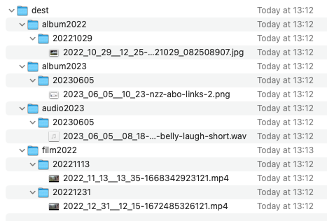

# Media Tools

## Installation

`npm install media-tools -g`

## How to Use

Execute `mediatools --archive --src source-directory --dest destination-directory`.

This command will create a `destination-directory` folder, which will contain subfolders
named `albumYYYY`, `filmYYYY`, `audioYYYY`. Each of these will further contain subfolders named based on the creation
date of the media files.

The software attempts to retrieve the EXIF creation date from the media. If it's unable to do so, it will default to
using the file creation time.

